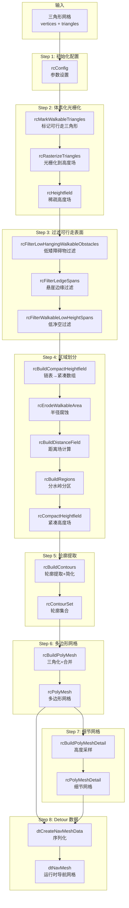

# Step 0：构建流程总览

## 1. handleBuild() 的定位

`Sample_SoloMesh::handleBuild()` 是 RecastDemo 中**单块 (Solo) 导航网格**的核心构建入口函数。
它将一个输入的三角形网格（polygon soup）经过 8 个步骤，最终转换为 Detour 运行时可用的导航网格数据。

**源文件**：`RecastDemo/Source/Sample_SoloMesh.cpp`（约 383~823 行）

---

## 2. 构建流程全景图



---

## 3. 数据流向与转换关系

构建过程中数据结构经历了以下关键转换：

```
三角形网格 (float* verts, int* tris)
    │
    │  rcRasterizeTriangles()
    ▼
rcHeightfield（稀疏高度场）
    │  - XZ 网格 + Span 链表
    │  - 表示"实体空间"
    │  - 链表存储，不利于缓存
    │
    │  rcBuildCompactHeightfield()
    ▼
rcCompactHeightfield（紧凑高度场）
    │  - XZ 网格 + Span 连续数组
    │  - 表示"开放空间"（可通行区域）
    │  - 数组存储，缓存友好
    │  - 包含四邻域连接、距离场、区域ID
    │
    │  rcBuildContours()
    ▼
rcContourSet（轮廓集合）
    │  - 每个区域一条轮廓多边形
    │  - 包含原始轮廓 + 简化轮廓
    │
    │  rcBuildPolyMesh()
    ▼
rcPolyMesh（多边形网格）
    │  - 凸多边形（≤6 顶点/多边形）
    │  - 体素坐标 (unsigned short)
    │  - 多边形邻接关系
    │
    │  rcBuildPolyMeshDetail()
    ▼
rcPolyMeshDetail（细节网格）
    │  - 为每个多边形提供高度细节
    │  - 细节三角形 + 额外顶点
    │  - 世界坐标 (float)
    │
    │  dtCreateNavMeshData()
    ▼
dtNavMesh（Detour 导航网格）
    - 运行时寻路数据
    - 包含 BVTree 加速空间查询
    - Off-Mesh 连接
```

---

## 4. 关键视角转换

整个构建过程中有一个至关重要的**视角转换**：

| 阶段 | 数据结构 | 视角 | 含义 |
|------|----------|------|------|
| Step 2 光栅化 | `rcHeightfield` (rcSpan) | **实体视角** | `[smin, smax]` 描述被几何体占据的空间 |
| Step 4 紧凑化 | `rcCompactHeightfield` (rcCompactSpan) | **空间视角** | `y` = 开放空间底面, `h` = 开放空间高度 |

这个转换是理解 Recast 数据结构的关键：

```
实体视角（rcSpan）：                    空间视角（rcCompactSpan）：
Y轴                                    Y轴
 ↑  ┌──────────┐                        ↑
 │  │ 实体 B   │ smin=30, smax=40       │  y=40, h=∞  ← 顶部开放空间
 │  └──────────┘                        │  ─────────
 │  （空气 20~30）                       │  y=20, h=10 ← 中间开放空间
 │  ┌──────────┐                        │  ─────────
 │  │ 实体 A   │ smin=0, smax=20        │  
 │  └──────────┘                        │  
```

---

## 5. 函数调用总览

```cpp
bool Sample_SoloMesh::handleBuild()
{
    // 前置检查 + 清理
    cleanup();

    // Step 1: 初始化 rcConfig
    rcCalcGridSize();

    // Step 2: 体素化
    rcAllocHeightfield() + rcCreateHeightfield();
    rcMarkWalkableTriangles();
    rcRasterizeTriangles();

    // Step 3: 过滤
    rcFilterLowHangingWalkableObstacles();
    rcFilterLedgeSpans();
    rcFilterWalkableLowHeightSpans();

    // Step 4: 区域划分
    rcBuildCompactHeightfield();
    rcErodeWalkableArea();
    rcMarkConvexPolyArea();           // 可选：标记自定义区域
    rcBuildDistanceField();           // Watershed 需要
    rcBuildRegions();                 // 或 rcBuildRegionsMonotone / rcBuildLayerRegions

    // Step 5: 轮廓
    rcBuildContours();

    // Step 6: 多边形网格
    rcBuildPolyMesh();

    // Step 7: 细节网格
    rcBuildPolyMeshDetail();

    // Step 8: Detour 数据
    dtCreateNavMeshData();
    dtNavMesh::init();
    dtNavMeshQuery::init();
}
```

---

## 6. 构建参数影响范围

```
┌─────────────────────────────────────────────────────────────────┐
│                        rcConfig 参数                            │
├──────────────────┬──────────────────────────────────────────────┤
│ cs (cellSize)    │ 影响整个流程的水平分辨率，体素越小越精细     │
│ ch (cellHeight)  │ 影响整个流程的垂直分辨率                     │
│ walkableHeight   │ Step 3 过滤 + Step 4 紧凑化连接判断          │
│ walkableClimb    │ Step 2 Span合并 + Step 3 过滤 + Step 4 连接  │
│ walkableRadius   │ Step 4 腐蚀                                  │
│ walkableSlopeAngle│ Step 2 标记可行走三角形                     │
│ maxEdgeLen       │ Step 5 轮廓简化                              │
│ maxSimplificationError │ Step 5 轮廓简化                        │
│ minRegionArea    │ Step 4 区域过滤                              │
│ mergeRegionArea  │ Step 4 区域合并                              │
│ maxVertsPerPoly  │ Step 6 多边形合并                            │
│ detailSampleDist │ Step 7 细节采样                              │
│ detailSampleMaxError │ Step 7 细节采样                          │
└──────────────────┴──────────────────────────────────────────────┘
```

---

## 7. 内存管理策略

handleBuild 中有一个 `m_keepInterResults` 开关控制中间结果的保留：

- **`m_keepInterResults = true`**（默认）：保留所有中间数据，供 Debug 绘制使用
- **`m_keepInterResults = false`**：每步完成后立即释放不再需要的数据

释放时机：

| 阶段完成后 | 可释放的数据 |
|-----------|-------------|
| Step 2 完成 | `m_triareas`（三角形区域数组） |
| Step 4 紧凑化完成 | `m_solid`（rcHeightfield） |
| Step 7 完成 | `m_chf`（rcCompactHeightfield）、`m_cset`（rcContourSet） |
