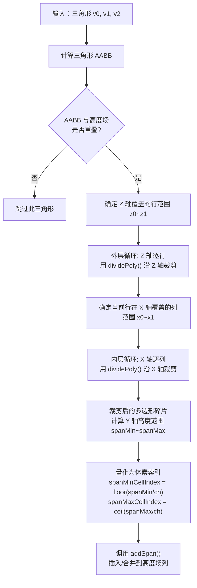

# Step 2：体素化光栅化

## 1. 概述

体素化是将输入的三角形网格（polygon soup）转换为体素高度场（`rcHeightfield`）的过程。
这是从连续几何表示到离散体素表示的关键转换，为后续所有处理步骤奠定数据基础。

**关键函数**：
- `rcAllocHeightfield()` + `rcCreateHeightfield()` — 创建高度场
- `rcMarkWalkableTriangles()` — 按坡度标记可行走三角形
- `rcRasterizeTriangles()` — 将三角形光栅化为 Span

**源文件**：`Recast/Source/RecastRasterization.cpp`

---

## 2. 高度场数据结构

### 2.1 rcHeightfield 结构

```
Z轴（height 方向）
 ↑  ┌───┬───┬───┬───┐
 3  │   │   │   │   │  ← spans[x + z * width]
    ├───┼───┼───┼───┤
 2  │   │   │   │   │     每个格子指向一个 Span 链表
    ├───┼───┼───┼───┤
 1  │   │   │   │   │
    ├───┼───┼───┼───┤
 0  │   │   │   │   │
    └───┴───┴───┴───┘
      0   1   2   3  → X轴（width 方向）
```

### 2.2 rcSpan 链表

每个 (x, z) 列中，Span 按 smin 从小到大排列，形成单链表：

```
Y轴(高度)
 ↑  ┌──────────┐
 │  │ Span C   │ smin=50, smax=60, area=0    → next = NULL
 │  └──────────┘
 │  （开放空间: 40~50 = 可通行区域）
 │  ┌──────────┐
 │  │ Span B   │ smin=30, smax=40, area=63   → next = Span C
 │  └──────────┘
 │  （开放空间: 20~30 = 可通行区域）
 │  ┌──────────┐
 │  │ Span A   │ smin=0, smax=20, area=63    → next = Span B
 │  └──────────┘
 +--→
```

### 2.3 Span 的位域布局

```cpp
struct rcSpan {
    unsigned int smin : 13;  // 底部高度 [0, 8191]
    unsigned int smax : 13;  // 顶部高度 [0, 8191]
    unsigned int area : 6;   // 区域 ID  [0, 63]
    rcSpan* next;            // 下一个更高的 Span
};
```

- `area = 0` (RC_NULL_AREA)：不可行走
- `area = 63` (RC_WALKABLE_AREA)：可行走
- `area = 1~62`：用户自定义区域

---

## 3. 光栅化流程

### 3.1 步骤一：标记可行走三角形

```cpp
rcMarkWalkableTriangles(ctx, walkableSlopeAngle, verts, nverts, tris, ntris, triareas);
```

对每个三角形计算法线，根据法线 Y 分量判断坡度：

```
法线 Y 分量 = cos(坡度角)

如果 cos(坡度角) > cos(walkableSlopeAngle):
    → 三角形足够平坦 → triareas[i] = RC_WALKABLE_AREA (63)
否则:
    → 三角形太陡 → triareas[i] = RC_NULL_AREA (0)
```

示意：
```
         /\  法线朝上，Y分量大 → 可行走
        /  \
       /____\
    ──────────── 地面

       ┃
       ┃ 法线朝侧面，Y分量小 → 不可行走（墙壁）
   ━━━━┃
```

### 3.2 步骤二：光栅化到高度场

```cpp
rcRasterizeTriangles(ctx, verts, nverts, tris, triareas, ntris, solid, walkableClimb);
```

核心函数 `rasterizeTri()` 的算法（Sutherland-Hodgman 风格逐行逐列裁剪）：



### 3.3 dividePoly 裁剪示意

```
裁剪前：三角形横跨多个网格格子
┌───┬───┬───┐
│   │  /│   │
│  /│/  │   │
│/  │   │   │
└───┴───┴───┘

裁剪后：按网格边界切割为碎片
┌───┬───┬───┐
│   │▓▓/│   │
│  /│▓/ │   │
│/▓▓│   │   │
└───┴───┴───┘
每个格子中的碎片独立计算 Y 范围
```

---

## 4. Span 的插入与合并

`addSpan()` 将新 Span 插入到列的链表中，处理重叠：

### 4.1 无重叠情况

```
已有：  [10, 20]  →  [30, 40]
新增：  [22, 28]
结果：  [10, 20]  →  [22, 28]  →  [30, 40]
```

### 4.2 重叠合并

```
已有：  [10, 20, area=63]
新增：  [18, 25, area=63]

高度差 = |20 - 18| = 2 ≤ walkableClimb
→ 合并为 [10, 25, area=63]
```

### 4.3 合并时的区域选择

当两个重叠 Span 的 smax 差 ≤ `flagMergeThreshold`（通常等于 walkableClimb）时：
- 取两者中**更大的 area 值**（即优先保留可行走标记）
- 这确保了"可行走面附近的小阶梯"不会被错误标记为不可行走

---

## 5. 内存池策略

Span 的分配采用**内存池**（pooling）策略，避免频繁的堆分配：

```
rcHeightfield::pools → [Pool 3] → [Pool 2] → [Pool 1] → NULL
                         ↑ 最新分配
                         
每个 Pool 包含 2048 个预分配的 rcSpan

freelist: 空闲 Span 链表
  分配: 从 freelist 头部取出
  归还: 插入 freelist 头部
  耗尽: 分配新 Pool，将其所有 Span 加入 freelist
```

---

## 6. 性能考量

光栅化是构建流程中**计算量最大**的步骤之一：

- `rasterizeTri()` 对每个三角形调用一次，是最热的函数
- 预计算 `inverseCellSize` 和 `inverseCellHeight` 避免循环内除法
- `dividePoly()` 使用栈上数组，避免堆分配
- Span 内存池避免频繁 malloc/free
