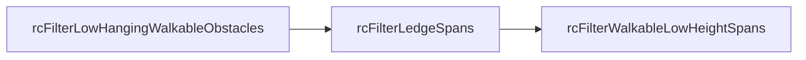

# Step 3：过滤可行走表面

## 1. 概述

光栅化后的高度场中，由于**保守光栅化**的特性，会产生一些伪可行走区域。
Step 3 通过三个过滤函数，移除 Agent 实际上无法站立或通行的 Span。

**三个过滤函数**（按调用顺序）：
1. `rcFilterLowHangingWalkableObstacles()` — 低矮悬挂障碍物
2. `rcFilterLedgeSpans()` — 悬崖边缘
3. `rcFilterWalkableLowHeightSpans()` — 低净空区域

**源文件**：`Recast/Source/RecastFilter.cpp`

---

## 2. 过滤一：低矮悬挂障碍物

### 2.1 功能

将紧靠在可行走表面上方的不可行走 Span 标记为可行走（如台阶、门槛、路缘石）。

### 2.2 判断条件

同一列中相邻的两个 Span，从下到上遍历：

```
条件1: 当前 Span 不可行走 (area == RC_NULL_AREA)
条件2: 前一个 Span 原本是可行走的
条件3: 两个 Span 顶面高度差 ≤ walkableClimb
```

三个条件同时满足时 → 当前 Span 继承下方 Span 的区域 ID。

### 2.3 示意图

```
过滤前：                          过滤后：
┌──────────┐                     ┌──────────┐
│ area = 0 │ ← 不可行走          │ area = 63│ ← 修正为可行走
│ smax = 12│                     │ smax = 12│
├──────────┤                     ├──────────┤
│ area = 63│ ← 可行走            │ area = 63│ ← 可行走
│ smax = 10│                     │ smax = 10│
└──────────┘                     └──────────┘
高度差 = 12 - 10 = 2             2 ≤ walkableClimb(2) → 修正！
```

### 2.4 防传播设计

使用**原始**可行走状态（修改前）而非修改后的状态，防止逐级向上的错误传播：

```
错误传播示例（如果使用修改后的值）：
┌──────────┐
│ Span C   │ smax=16, area=0 → 0→63 ❌ 错误！距地面太远
├──────────┤
│ Span B   │ smax=14, area=0→63 ✓ 正确修正
├──────────┤
│ Span A   │ smax=10, area=63 ← 原始可行走
└──────────┘

使用原始值：B 被修正（A 原本可行走），C 不被修正（B 原本不可行走）
```

---

## 3. 过滤二：悬崖边缘

### 3.1 功能

检查每个可行走 Span 的四个正交邻居（±X, ±Z），如果存在悬崖（过大的高度落差），
将该 Span 标记为不可行走。

### 3.2 判断逻辑

对于当前可行走 Span，检查四个方向的邻居列：

```cpp
floor = span->smax;                // 当前 Span 的地面高度
ceiling = span->next ? span->next->smin : MAX_HEIGHT;  // 天花板高度

对于每个邻居列中的每个邻居 Span：
    neighborFloor = neighborSpan->smax;
    neighborCeiling = neighborSpan->next ? ... : MAX_HEIGHT;
    
    // 1. 检查是否有足够的通行空间
    if (min(ceiling, neighborCeiling) - max(floor, neighborFloor) < walkableHeight)
        continue;  // 两者之间空间不足以通行
    
    // 2. 记录最低邻居高度差
    lowestNeighborFloorDifference = min(lowestNeighborFloorDifference, neighborFloor - floor);
    
    // 3. 记录可达邻居的最高/最低地面
    if (abs(neighborFloor - floor) <= walkableClimb)
        更新 lowestTraversableNeighborFloor, highestTraversableNeighborFloor;
```

标记为不可行走的两个条件（满足任一即可）：

```
条件1: lowestNeighborFloorDifference < -walkableClimb
       → 存在一个"可通行但落差过大"的邻居（悬崖边缘）

条件2: highestTraversableNeighborFloor - lowestTraversableNeighborFloor > walkableClimb
       → 可达邻居之间的高度差过大（陡坡）
```

### 3.3 示意图

```
俯视图（X-Z 平面）：
       ┌───┐
       │N1 │ 地面高度 = 5
  ┌───┼───┼───┐
  │N4 │ S │N2 │ S 的地面高度 = 20
  └───┼───┼───┘ N2 地面高度 = 5
       │N3 │ 
       └───┘

S 到 N2 的落差 = 5 - 20 = -15
如果 walkableClimb = 4，|15| > 4 → S 被标记为悬崖边缘（不可行走）
```

---

## 4. 过滤三：低净空区域

### 4.1 功能

如果一个 Span 的地面到上方"天花板"（上方 Span 的底面）之间的净空高度
小于 `walkableHeight`，说明 Agent 站不起来，标记为不可行走。

### 4.2 判断条件

```cpp
floor = span->smax;                                    // 地面
ceiling = span->next ? span->next->smin : MAX_HEIGHT;  // 天花板
if (ceiling - floor < walkableHeight)
    span->area = RC_NULL_AREA;  // 不可行走
```

### 4.3 示意图

```
净空足够（walkableHeight = 4）：      净空不足：
                                     
┌──────────┐ smin=25                  ┌──────────┐ smin=23
│ 上方 Span│                          │ 上方 Span│
└──────────┘                          └──────────┘
                                      
  净空 = 25 - 20 = 5                    净空 = 23 - 20 = 3
  5 ≥ 4 → ✓ 可行走                     3 < 4 → ✗ 不可行走
                                      
┌──────────┐ smax=20                  ┌──────────┐ smax=20
│ 当前 Span│ area=63 ✓                │ 当前 Span│ area=0 ✗
└──────────┘                          └──────────┘
```

---

## 5. 三个过滤器的执行顺序

执行顺序是经过精心设计的：



1. **低矮障碍物**先执行：将台阶等修正为可行走，以免后续过滤器错误移除
2. **悬崖边缘**次执行：检查邻居关系，需要在低矮障碍物修正后进行
3. **低净空**最后执行：这是最简单的本地检查，不依赖其他过滤结果

---

## 6. 过滤前后的对比

```
过滤前（光栅化直接输出）：        过滤后（三步过滤完成）：

可行走   ████████████              可行走   ██████████
         ████████████                       ██████████
         ███ 台阶 ███              台阶修正  █████████████
         ████████████                       ██████████
  悬崖→  ████████████                       ██████
  低矮→  ██ 低空 ████              低空移除  ██    ████
```

过滤后，只剩下 Agent 真正可以安全站立和通行的表面。
