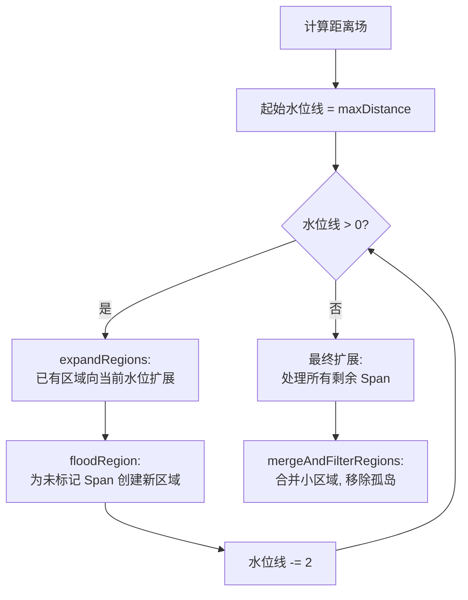

# Step 4：区域划分

## 1. 概述

Step 4 是整个构建流程中**最复杂**的步骤，包含多个子步骤：
1. 将稀疏高度场转换为紧凑高度场
2. 按 Agent 半径腐蚀可行走区域
3. 标记自定义区域（可选）
4. 构建距离场（Watershed 需要）
5. 执行区域划分（三种算法可选）

**源文件**：
- `Recast/Source/Recast.cpp` — 紧凑高度场构建
- `Recast/Source/RecastArea.cpp` — 腐蚀
- `Recast/Source/RecastRegion.cpp` — 距离场和区域划分

---

## 2. 紧凑高度场转换 (rcBuildCompactHeightfield)

### 2.1 核心转换：实体视角 → 空间视角

这是整个构建流程中最关键的数据转换：

```
rcHeightfield (链表式)              rcCompactHeightfield (数组式)
──────────────────                  ──────────────────────
存储：实体空间 [smin, smax]          存储：开放空间 [y, h]
视角：哪里有东西                     视角：哪里可以走
结构：链表 (缓存不友好)              结构：连续数组 (缓存友好)
包含：所有 Span (含不可行走)         包含：仅可行走 Span
```

### 2.2 转换示意

```
原始 Span 链表 (一列):              紧凑 Span 数组:
Y轴                                 
 ↑  ┌──────┐ smin=40               CompactSpan[2]: y=30, h=10
 │  │不可走│                        CompactSpan[1]: y=20, h=10  
 │  └──────┘ smax=30               CompactSpan[0]: y=10, h=10  
 │  ┌──────┐ smin=30
 │  │不可走│                        
 │  └──────┘ smax=20                注意：
 │  ┌──────┐ smin=20                - y = 原 smax (实体顶面 = 开放空间底面)
 │  │可行走│ area=63                - h = 上方 smin - 当前 smax (开放空间高度)
 │  └──────┘ smax=10                - 不可行走的 Span 被丢弃
 │  ┌──────┐ smin=0
 │  │可行走│ area=63
 │  └──────┘
```

### 2.3 数据结构

```cpp
struct rcCompactCell {
    unsigned int index : 24;  // 该列第一个 Span 在 spans[] 中的索引
    unsigned int count : 8;   // 该列的 Span 数量 (最多 255)
};

struct rcCompactSpan {
    unsigned short y;        // 开放空间底面高度 (体素单位)
    unsigned short reg;      // 所属区域 ID (后续填充)
    unsigned int con : 24;   // 四方向邻居连接 (每方向 6 位)
    unsigned int h : 8;      // 开放空间高度 (最大 255 体素)
};
```

### 2.4 四邻域连接建立

转换完成后，为每个 CompactSpan 建立与四个正交邻居的连接：

```
连接条件:
  1. 邻居存在 (不越界)
  2. 两个 Span 的 "开放空间重叠区域" 高度 ≥ walkableHeight
  3. 两个 Span 底面高度差 ≤ walkableClimb

con 字段编码 (24 位):
  方向0 (6位) | 方向1 (6位) | 方向2 (6位) | 方向3 (6位)
  (-x 方向)   | (+z 方向)   | (+x 方向)   | (-z 方向)

值 = 邻居列中对应 Span 的局部索引 (0~254)
RC_NOT_CONNECTED (0x3f) 表示无连接
```

---

## 3. 半径腐蚀 (rcErodeWalkableArea)

### 3.1 原理

将可行走区域从边界向内收缩 `walkableRadius` 个体素，确保 Agent 中心不会过于靠近障碍物。

### 3.2 算法：两遍 Chamfer 距离变换

```
第一遍 (左→右, 上→下):         第二遍 (右→左, 下→上):
传播 正交代价=2, 对角代价=3      反向传播, 取更小值

结果: 每个 Span 获得到最近边界的近似距离值
距离编码: 1个体素 ≈ 距离值 2

最终: 距离 < erosionRadius * 2 的 Span → area = RC_NULL_AREA
```

### 3.3 示意图

```
腐蚀前 (俯视图):                腐蚀后:
┌──────────────┐                ┌──────────────┐
│██████████████│                │    ████████  │
│██████████████│                │    ████████  │
│███     ██████│  ← 障碍物      │███    ████  │
│██████████████│                │    ████████  │
│██████████████│                │    ████████  │
└──────────────┘                └──────────────┘
██ = 可行走                     内缩了 walkableRadius 体素
```

---

## 4. 自定义区域标记 (rcMarkConvexPolyArea)

用户可在编辑器中绘制凸多边形体积来标记特殊区域：

```cpp
const ConvexVolume* vols = m_geom->getConvexVolumes();
for (int i = 0; i < m_geom->getConvexVolumeCount(); ++i)
    rcMarkConvexPolyArea(ctx, vols[i].verts, vols[i].nverts,
                         vols[i].hmin, vols[i].hmax,
                         (unsigned char)vols[i].area, *m_chf);
```

区域类型示例：
- `SAMPLE_POLYAREA_GROUND` (0) — 普通地面
- `SAMPLE_POLYAREA_WATER` (1) — 水域
- `SAMPLE_POLYAREA_ROAD` (2) — 道路
- `SAMPLE_POLYAREA_DOOR` (3) — 门
- `SAMPLE_POLYAREA_GRASS` (4) — 草地

---

## 5. 距离场构建 (rcBuildDistanceField)

### 5.1 目的

为 Watershed 分区算法提供"高度图"。距离场描述每个 Span 到最近**区域边界**的距离。

### 5.2 算法

与腐蚀中的距离变换类似，但**边界定义不同**：

| | 腐蚀中的距离场 | 区域划分的距离场 |
|--|--|--|
| 边界定义 | 不可行走的 Span | 区域类型不同的相邻 Span |
| 用途 | 收缩可行走区域 | 作为 Watershed 的"地形高度" |

### 5.3 三步处理

```
1. calculateDistanceField() — 两遍 Chamfer 距离变换
2. boxBlur()                — 3×3 盒式模糊平滑
3. 存入 chf.dist[]          — 供 Watershed 使用
```

模糊平滑的目的是消除距离场中的噪声，让区域边界更平滑。

---

## 6. 区域划分算法（三选一）

### 6.1 Watershed 分水岭（默认）



核心思想：
- 距离场 = 地形高度（距离边界越远 = 越高的"山峰"）
- 从最高的"山顶"（距离最远的点）开始
- 逐级"降水"，水从高处流向低处
- 不同"流域"的分界处就是区域边界

```
距离场可视化:           区域划分结果:
    4 4 3                A A B
  4 5 5 4 3            A A A B B
  4 5 5 4 3            A A A B B
    4 4 3                A A B
    
5 = 最高点(种子)       A、B = 两个不同区域
```

### 6.2 Monotone 单调分区

```
特点: 最快，无需距离场
算法: 逐行扫描，按连通关系合并
优点: 保证无孔洞无重叠
缺点: 产生细长多边形，可能导致路径绕行
适用: 需要快速生成 NavMesh 的场景
```

### 6.3 Layer 分层分区

```
特点: 速度较快，无重叠
算法: 逐行扫描，然后按层合并
优点: 三角化质量优于 Monotone
适用: 中小尺寸 Tile 的分块 NavMesh
注意: 不需要 rcBuildDistanceField
```

### 6.4 三种算法对比

| 特性 | Watershed | Monotone | Layer |
|------|-----------|----------|-------|
| 速度 | 最慢 | 最快 | 较快 |
| 需要距离场 | ✓ | ✗ | ✗ |
| 网格质量 | 最好 | 较差 | 中等 |
| 孔洞风险 | 极端情况可能 | 无 | 无 |
| 细长多边形 | 少 | 多 | 中等 |
| 适用场景 | 大型开阔区域 | 快速生成 | 分块 Tile |
