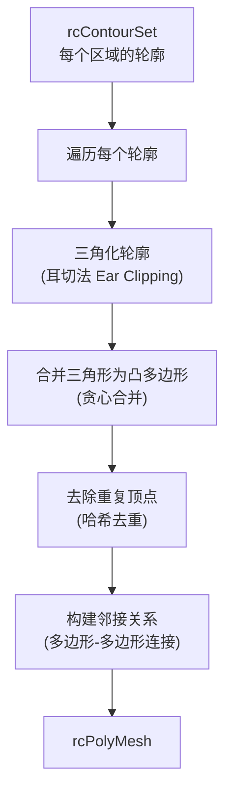

# Step 6：构建多边形网格

## 1. 概述

Step 6 将轮廓集合中的每个轮廓进行三角化，然后将相邻三角形合并为凸多边形
（最多 `maxVertsPerPoly` 个顶点），生成最终的多边形网格。

**关键函数**：`rcBuildPolyMesh()`

**源文件**：`Recast/Source/RecastMesh.cpp`

---

## 2. 构建流程



### 2.1 轮廓三角化

对每个轮廓使用**耳切法**（Ear Clipping）进行三角化：

```
输入轮廓 (6 个顶点):          三角化结果 (4 个三角形):
    ·───·                        ·───·
   / \   \                      /|\   \
  ·   ·    ·                   · | ·    ·
   \     /                      \|   \ /
    ·───·                        ·─────·
```

### 2.2 三角形合并为凸多边形

使用贪心算法将相邻三角形合并为凸多边形（最多 `nvp` 个顶点）：

```
三角化后 (4 个三角形):         合并后 (2 个凸多边形):
  ·───·───·                     ·───·───·
  |\ | / |                     |       |
  | \|/  |                     |  P0   |
  ·──·───·                     ·───────·
  |  |\ |                      |       |
  |  | \|                      |  P1   |
  ·──·──·                      ·───────·

合并条件:
1. 两个三角形共享一条边
2. 合并后仍为凸多边形
3. 合并后顶点数 ≤ maxVertsPerPoly
```

---

## 3. rcPolyMesh 数据结构

```cpp
struct rcPolyMesh {
    unsigned short* verts;   // 顶点数组 [(x, y, z) * nverts]，体素坐标
    unsigned short* polys;   // 多边形数组 [大小: maxpolys * 2 * nvp]
    unsigned short* regs;    // 每个多边形的区域 ID
    unsigned short* flags;   // 每个多边形的用户标志
    unsigned char* areas;    // 每个多边形的区域类型
    int nverts;              // 顶点数
    int npolys;              // 多边形数
    int maxpolys;            // 已分配的多边形数
    int nvp;                 // 每个多边形最大顶点数
    float bmin[3], bmax[3];  // 包围盒
    float cs, ch;            // 体素尺寸
};
```

### 3.1 多边形数组 (polys) 的存储格式

每个多边形占 `2 * nvp` 个 `unsigned short`：

```
前半部分 (nvp 个): 顶点索引 (不足 nvp 用 0xffff 填充)
后半部分 (nvp 个): 邻居多边形索引 (无邻居用 0xffff 填充)

示例 (nvp = 6, 一个四边形):
  [v0, v1, v2, v3, 0xffff, 0xffff,    ← 4 个有效顶点
   n0, n1, n2, n3, 0xffff, 0xffff]    ← 4 条边的邻居多边形

邻居编码:
  0xffff            = 无邻居 (边界边)
  index             = 邻居多边形在 polys 数组中的索引
  index | 0x8000    = 外部边界连接（边界区域标志）
```

### 3.2 顶点坐标

顶点使用 `unsigned short` 存储**体素坐标**：

```
世界坐标 = bmin + 体素坐标 * cs/ch

worldX = bmin[0] + verts[i*3+0] * cs
worldY = bmin[1] + verts[i*3+1] * ch
worldZ = bmin[2] + verts[i*3+2] * cs
```

---

## 4. 邻接关系

### 4.1 建立过程

遍历所有多边形的边，对于共享同一条边的两个多边形，记录互为邻居：

```
多边形 P0 和 P1 共享边 (v1, v2):

  P0: [v0, v1, v2, v3]     P1: [v2, v1, v4, v5]
       邻居: [_, P1, _, _]       邻居: [_, P0, _, _]
                                  
  ·───v1───·                      边 (v1,v2) 是 P0 和 P1 的共享边
  │   │    │                      P0 的第 1 条边的邻居 = P1
  │P0 │ P1 │                      P1 的第 1 条边的邻居 = P0
  │   │    │
  ·───v2───·
```

### 4.2 用途

邻接关系在 Detour 运行时用于**图搜索寻路**：
- A* 算法沿多边形邻接关系搜索
- 路径是一系列相邻多边形的序列

---

## 5. 顶点去重

多个轮廓可能共享相同位置的顶点。构建过程使用**哈希表**对顶点进行去重：

```
轮廓 A 的顶点: (10, 5, 20)
轮廓 B 的顶点: (10, 5, 20)  ← 与 A 相同位置

去重后: 两个轮廓共享同一个顶点索引
→ 这确保了多边形邻接关系的正确建立
```

---

## 6. maxVertsPerPoly 的影响

```
maxVertsPerPoly = 3 (纯三角形):    maxVertsPerPoly = 6 (凸多边形):
  ·───·───·                          ·───·───·
  |\ | / |                           |       |
  | \|/  |                           |       |
  ·──·───·                           ·───────·
  更多多边形，更细粒度                  更少多边形，更高效寻路
  Detour 不支持此值                    Detour 推荐值 (DT_VERTS_PER_POLYGON=6)
```

`maxVertsPerPoly` 越大：
- 多边形数量越少 → 寻路图更小 → A* 搜索更快
- 但每个多边形内的几何复杂度增加
- Detour 限制最大为 6 (`DT_VERTS_PER_POLYGON`)
