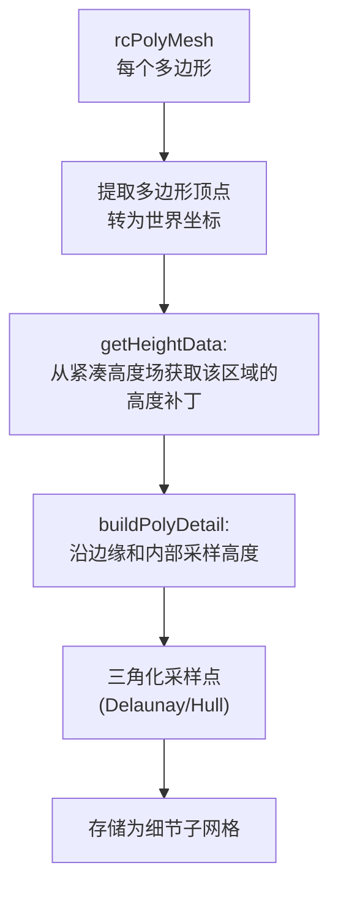
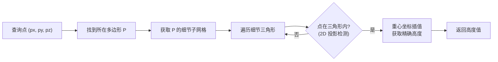

# Step 7：构建细节网格

## 1. 概述

多边形网格中的多边形是**平面的**（顶点只有体素精度的高度），无法精确表示地形的起伏。
Step 7 为每个多边形添加额外的高度采样点和细节三角形，使得运行时可以获取精确的高度信息。

**关键函数**：`rcBuildPolyMeshDetail()`

**源文件**：`Recast/Source/RecastMeshDetail.cpp`

---

## 2. 为什么需要细节网格？

```
多边形网格 (体素精度):              细节网格 (采样精度):

俯视图相同:                         
  ·───────·                          ·───────·
  │       │                          │ · · · │
  │  P0   │                          │· · · ·│
  │       │                          │ · · · │
  ·───────·                          ·───────·

侧视图不同:
  ──────────── 平坦的多边形            ·   ·   ·
                                     / \ / \ / \  起伏的地形
                                    ·   ·   ·   ·
```

没有细节网格时：
- 查询 P0 内某点的高度 → 只能返回多边形边界顶点的插值高度
- 对于起伏地形，误差可能很大

有了细节网格后：
- P0 被细分为多个小三角形，每个顶点都有精确的高度值
- 查询时通过重心坐标插值获得精确高度

---

## 3. 构建流程



### 3.1 高度补丁 (Height Patch)

对每个多边形，从紧凑高度场中提取覆盖该多边形的高度数据：

```cpp
struct rcHeightPatch {
    int xmin, ymin;     // 补丁在 XZ 网格中的起始位置
    int width, height;  // 补丁尺寸
    unsigned short* data; // 高度数组 [width * height]
};
```

### 3.2 采样策略

```
1. 边缘采样: 沿多边形的每条边，按 sampleDist 间距采样
             如果采样点的实际高度与多边形边的插值高度差 > sampleMaxError
             → 保留该采样点

2. 内部采样: 在多边形内部按网格布点
             同样检查高度误差
             超过阈值的采样点被保留
```

```
多边形 P0 内的采样:
  ·───────────────·
  │ o   o   o   o │  o = 候选采样点
  │   o   o   o   │  
  │ o   o   o   o │  黑点 = 高度误差超阈值,保留
  │   o   ●   o   │  白点 = 高度误差在阈值内,丢弃
  │ o   o   o   o │
  ·───────────────·
```

### 3.3 sampleDist 和 sampleMaxError 的影响

```
sampleDist 小 + sampleMaxError 小:    sampleDist 大 + sampleMaxError 大:
  ·─·─·─·─·─·                          ·───────·
  │·│·│·│·│·│                          │       │
  ·─·─·─·─·─·                          │   ·   │
  │·│·│·│·│·│                          │       │
  ·─·─·─·─·─·                          ·───────·
  
高精度, 多三角形, 大内存               低精度, 少三角形, 小内存
```

---

## 4. rcPolyMeshDetail 数据结构

```cpp
struct rcPolyMeshDetail {
    unsigned int* meshes;    // 子网格描述 [4 * nmeshes]
    float* verts;            // 细节顶点 [3 * nverts]，世界坐标
    unsigned char* tris;     // 细节三角形 [4 * ntris]
    int nmeshes;             // 子网格数量 (= rcPolyMesh::npolys)
    int nverts;              // 总顶点数
    int ntris;               // 总三角形数
};
```

### 4.1 meshes 数组

每个多边形对应一个子网格描述，占 4 个 `unsigned int`：

```
meshes[i*4+0] = vertBase     第一个细节顶点在 verts[] 中的起始索引
meshes[i*4+1] = vertCount    细节顶点数量
meshes[i*4+2] = triBase      第一个细节三角形在 tris[] 中的起始索引
meshes[i*4+3] = triCount     细节三角形数量
```

### 4.2 tris 数组

每个三角形占 4 个字节：

```
tris[j*4+0] = 顶点 A 的局部索引
tris[j*4+1] = 顶点 B 的局部索引
tris[j*4+2] = 顶点 C 的局部索引
tris[j*4+3] = 边标志 (哪些边属于多边形边界)

顶点索引的解释:
  如果 index < polyVertCount:  是原始多边形的顶点 (从 rcPolyMesh 获取坐标)
  如果 index >= polyVertCount: 是新增的细节顶点 (从 verts[vertBase + ...] 获取)
```

### 4.3 边标志

```
bit 0-1: 边 (v0, v1) 的标志
bit 2-3: 边 (v1, v2) 的标志
bit 4-5: 边 (v2, v0) 的标志

值含义:
  0 = 内部边 (不在多边形边界上)
  1 = 在多边形边界上
```

---

## 5. 运行时高度查询

细节网格在运行时通过 `dtNavMeshQuery::getPolyHeight()` 使用：



```
查询示例:
  多边形 P0 被细分为 3 个细节三角形: T0, T1, T2
  查询点 Q 落在 T1 内
  → 用 T1 的三个顶点做重心坐标插值
  → 返回 Q 处的精确高度
```

---

## 6. 内存释放

细节网格构建完成后，紧凑高度场和轮廓集合不再需要：

```cpp
if (!m_keepInterResults) {
    rcFreeCompactHeightfield(m_chf);  // 不再需要
    m_chf = 0;
    rcFreeContourSet(m_cset);          // 不再需要
    m_cset = 0;
}
```
