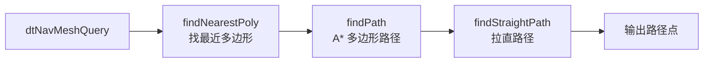

# Step 8：创建 Detour 导航数据

## 1. 概述

Step 8 是构建流程的最后一步，将 Recast 构建的多边形网格和细节网格转换为 Detour 运行时
可用的导航网格二进制数据，并初始化导航网格查询对象。

**关键函数**：
- `dtCreateNavMeshData()` — 序列化导航数据
- `dtNavMesh::init()` — 初始化导航网格
- `dtNavMeshQuery::init()` — 初始化查询对象

**源文件**：`Detour/Source/DetourNavMeshBuilder.cpp`

---

## 2. 区域到标志位映射

在创建 Detour 数据之前，先将 Recast 的区域类型转换为运行时的通行标志：

```cpp
for (int i = 0; i < m_pmesh->npolys; ++i)
{
    // 将通用可行走区域映射为具体的地面区域
    if (m_pmesh->areas[i] == RC_WALKABLE_AREA)
        m_pmesh->areas[i] = SAMPLE_POLYAREA_GROUND;
    
    // 根据区域类型设置通行标志
    if (areas[i] == SAMPLE_POLYAREA_GROUND ||
        areas[i] == SAMPLE_POLYAREA_GRASS ||
        areas[i] == SAMPLE_POLYAREA_ROAD)
        flags[i] = SAMPLE_POLYFLAGS_WALK;       // 可步行
    else if (areas[i] == SAMPLE_POLYAREA_WATER)
        flags[i] = SAMPLE_POLYFLAGS_SWIM;       // 可游泳
    else if (areas[i] == SAMPLE_POLYAREA_DOOR)
        flags[i] = SAMPLE_POLYFLAGS_WALK | SAMPLE_POLYFLAGS_DOOR;  // 可步行+可开门
}
```

### 2.1 区域与标志的关系

```
区域 (Area)                     标志 (Flags)
──────────────                  ──────────────
语义：这里是什么                 语义：Agent 能做什么
存储在构建阶段                   存储在运行时

SAMPLE_POLYAREA_GROUND ──→ SAMPLE_POLYFLAGS_WALK
SAMPLE_POLYAREA_GRASS  ──→ SAMPLE_POLYFLAGS_WALK
SAMPLE_POLYAREA_ROAD   ──→ SAMPLE_POLYFLAGS_WALK
SAMPLE_POLYAREA_WATER  ──→ SAMPLE_POLYFLAGS_SWIM
SAMPLE_POLYAREA_DOOR   ──→ SAMPLE_POLYFLAGS_WALK | SAMPLE_POLYFLAGS_DOOR
```

运行时寻路可以通过标志位进行过滤：
- 人类 Agent：`includeFlags = WALK | DOOR`
- 鱼类 Agent：`includeFlags = SWIM`
- 通用 Agent：`includeFlags = WALK | SWIM | DOOR`

---

## 3. dtNavMeshCreateParams 填充

将所有构建结果组装到创建参数结构体中：

```cpp
dtNavMeshCreateParams params;
memset(&params, 0, sizeof(params));

// ====== 多边形网格数据 ======
params.verts = m_pmesh->verts;            // 顶点 (体素坐标)
params.vertCount = m_pmesh->nverts;
params.polys = m_pmesh->polys;            // 多边形索引 + 邻接
params.polyAreas = m_pmesh->areas;        // 区域类型
params.polyFlags = m_pmesh->flags;        // 通行标志
params.polyCount = m_pmesh->npolys;
params.nvp = m_pmesh->nvp;               // 每多边形最大顶点数

// ====== 细节网格数据 ======
params.detailMeshes = m_dmesh->meshes;    // 子网格描述
params.detailVerts = m_dmesh->verts;      // 细节顶点 (世界坐标)
params.detailVertsCount = m_dmesh->nverts;
params.detailTris = m_dmesh->tris;        // 细节三角形
params.detailTriCount = m_dmesh->ntris;

// ====== Off-Mesh 连接 ======
params.offMeshConVerts = ...;             // 端点坐标
params.offMeshConRad = ...;               // 连接半径
params.offMeshConDir = ...;               // 方向 (单向/双向)
params.offMeshConAreas = ...;             // 区域类型
params.offMeshConFlags = ...;             // 通行标志
params.offMeshConUserID = ...;            // 用户 ID
params.offMeshConCount = ...;             // 连接数量

// ====== Agent 参数 (世界单位) ======
params.walkableHeight = m_agentHeight;
params.walkableRadius = m_agentRadius;
params.walkableClimb = m_agentMaxClimb;

// ====== 几何参数 ======
rcVcopy(params.bmin, m_pmesh->bmin);
rcVcopy(params.bmax, m_pmesh->bmax);
params.cs = m_cfg.cs;
params.ch = m_cfg.ch;
params.buildBvTree = true;                // 构建 BVTree
```

---

## 4. dtCreateNavMeshData 序列化

`dtCreateNavMeshData()` 将所有数据序列化为一个连续的二进制缓冲区：

```
导航数据二进制布局:
┌────────────────────────────┐
│ dtMeshHeader               │ 头部信息 (魔数、版本、多边形数等)
├────────────────────────────┤
│ dtPoly[]                   │ 多边形数组 (顶点索引、邻居、标志)
├────────────────────────────┤
│ float[] verts              │ 顶点坐标 (转换为世界坐标)
├────────────────────────────┤
│ dtLink[]                   │ 链接数组 (用于运行时邻接图)
├────────────────────────────┤
│ dtPolyDetail[]             │ 细节子网格描述
├────────────────────────────┤
│ float[] detailVerts        │ 细节顶点
├────────────────────────────┤
│ unsigned char[] detailTris │ 细节三角形
├────────────────────────────┤
│ dtBVNode[]                 │ BVTree 节点 (空间查询加速)
├────────────────────────────┤
│ dtOffMeshConnection[]      │ Off-Mesh 连接
└────────────────────────────┘
```

### 4.1 BVTree (Bounding Volume Tree)

BVTree 用于加速"给定坐标，找到最近多边形"的空间查询：

```
          [根节点 AABB]
         /             \
    [左子 AABB]     [右子 AABB]
    /      \         /      \
  [P0]   [P1]     [P2]   [P3]

查询时从根节点开始：
  如果查询点不在当前节点 AABB 内 → 剪枝整个子树
  否则递归到子节点
  
效果：O(log n) 的查询复杂度，相比遍历所有多边形的 O(n) 大幅提升
```

---

## 5. 导航网格初始化

```cpp
// 创建导航网格对象
m_navMesh = dtAllocNavMesh();

// 用序列化数据初始化 (DT_TILE_FREE_DATA = 导航网格拥有数据所有权)
m_navMesh->init(navData, navDataSize, DT_TILE_FREE_DATA);

// 初始化查询对象 (最大节点池 2048)
m_navQuery->init(m_navMesh, 2048);
```

### 5.1 DT_TILE_FREE_DATA 标志

```
DT_TILE_FREE_DATA = 导航网格接管 navData 内存的所有权
  → dtNavMesh 析构时自动释放 navData
  → 不需要手动 dtFree(navData)

如果不设此标志:
  → 调用方负责管理 navData 的生命周期
  → 必须确保 navData 在 dtNavMesh 使用期间保持有效
```

---

## 6. 初始化完成后的使用

导航网格初始化完成后，即可进行运行时寻路：



```cpp
// 典型寻路流程
dtPolyRef startPoly, endPoly;
navQuery->findNearestPoly(startPos, extents, &filter, &startPoly, 0);
navQuery->findNearestPoly(endPos, extents, &filter, &endPoly, 0);
navQuery->findPath(startPoly, endPoly, startPos, endPos, &filter, path, &pathCount, maxPath);
navQuery->findStraightPath(startPos, endPos, path, pathCount, straightPath, ...);
```

---

## 7. Off-Mesh 连接

Off-Mesh 连接是用户定义的特殊跨越连接（如跳跃点、传送门、梯子等）：

```
正常导航网格连接:            Off-Mesh 连接:
  ·─────·─────·                ·─────·      ·─────·
  │  P0 │  P1 │                │  P0 │      │  P2 │
  ·─────·─────·                ·──┬──·      ·──┬──·
                                  │    ╭─╮    │
                                  └────│ │────┘
                                       ╰─╯
                                  跳跃/传送连接
```

Off-Mesh 连接的参数：
- **verts**: 起点和终点坐标
- **rad**: 连接半径（Agent 到达起点多近时触发连接）
- **dir**: 方向（0=双向, 1=单向）
- **areas/flags**: 区域和标志（与普通多边形一致）
